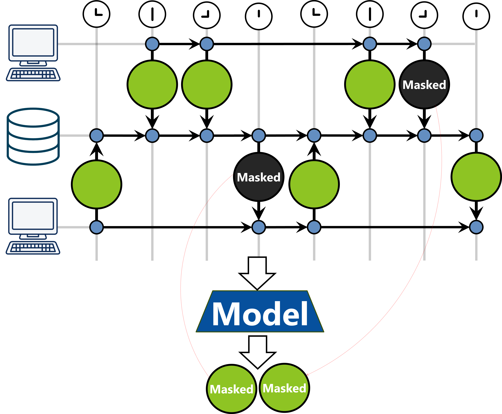
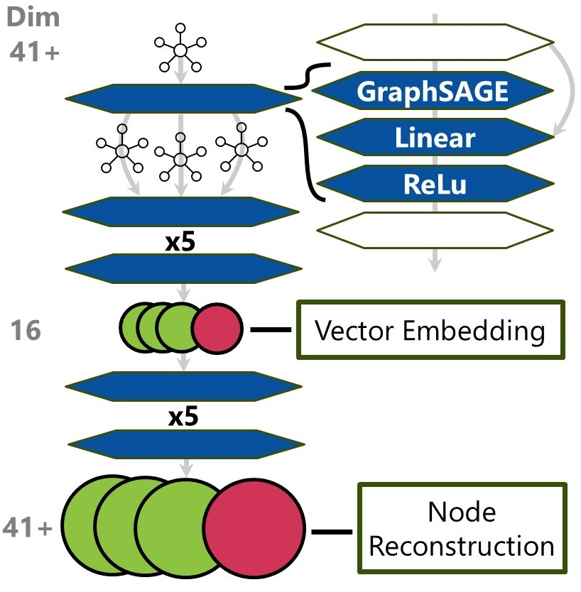

# Anomaly Detection GNN Model
GNN model computes a graph based view of the network logs and detects anomalous traffic within the local graph context. 


<!-- toc -->
- [Anomaly Detection GNN Model](#anomaly-detection-gnn-model)
- [What it Does](#what-it-does)
- [How it Works](#how-it-works)
- [Navigating This Repository](#navigating-this-repository)
  - [Folders](#folders)
- [Running the Model](#running-the-model)
- [Known Drawbacks/Concerns](#known-drawbacksconcerns)
- [Future Development](#future-development)

<!-- tocstop -->


# What it Does
The GNN anomaly detection model searches saved network capture data to detect potentially malicious anomalous activity. 

# How it Works
The GNN model is a machine learning neural network that operates on information associated with nodes in a graph. It uses the structure of the graph to produce a neighborhood around each node. The information across a node's neighbors is the only information the model uses in its input. This is similar to a convolutional network, where a pixel's color only affects the result of nearby pixels during each convolution layer.

This GNN is trained to predict the features of the original node. The network structure is like those that would be used for a graph autoencoder network. The output dimension is equal to the input dimension, and the output loss is the distance from the original node features.

However, this is not an autoencoding task. The nodes are sampled in minibatches. The node features for the nodes that are part of the minibatch are dropped (set to 0). This means that the only way to reconstruct the node's featuers is to predict them based on the neighborhood around a node. The model is less succesful at this prediction task than an autoencoder model, but the model beneficially makes use of the context this way. 



The anomaly score is based on how close the prediction comes to reality. 



# Navigating This Repository
## Folders
**assets:** images and supplementary files for documents like the readme

**code/configs:** any config files used for cleaning objects

**code/data:** data utils (from https://github.com/IdahoLabUnsupported/sequential-network-anomaly-detection/tree/main/data) used for data preprocessing. 

**code/lib_code:** code for data preprocessing and task description

**code/model_code:** code for pytorch models

**old:** Unused files

## Modules
For more information about any of the files listed below, visit the file itself and read docstring.

### Zeek (data.datasets)
The Zeek class can be used for reading of Zeek/Corelight output files.

**Current Functionality:**
1. Reads Zeek files from messy directories as log or parquet files
2. Train/test splitting data
3. Log file sorting
4. Targeted IP removal and row filtering
6. More descriptive exceptions and warnings
7. Perform Zeek -> ZeekGraph Conversion
8. Saving of data objects to python pickle files for fast reading

### ZeekCleaner (data.cleaning)
Packages LogCleaners nicely and iterably for Zeek to call. Allows a seamless conversion from Zeek to ZeekGraph.

### LogCleaner (data.log_cleaners)
*Abstract.* Class outline for individual file cleaners. Log types are handled on a case by case basis.
Example is available via GeneralCleaner, which usually works for most data.

### ZeekIds (lib_code.data_tools)
Utility for providing numeric IDs to Zeek columns. Useful for creating a unique Id column or for creating clean ZeekGraph objects.

### ZeekTransforms (lib_code.data_tools)
Utilities for altering multiple Zeek objects. Includes column operations, log operations, copying and deleting.

### ZeekGraph (lib_code.data_tools)
This ZeekGraph class converts a Zeek object into a pytorch graph or HeteroGraph object.
The methods describe how the Zeek object should be interpreted as nodes and edges.

### CreateDataset (lib_code.create_dataset)
This high level script class handles the whole dataset construction process. 

### DictCleaner (lib_code.cleaners)
*Abstract.* Class representing a ZeekClenaer which uses sklearn transforms described in a dict.

### Task (lib_code.task)
Class representing a machine learning task. Subclasses contain many overrided functions.


# Running the Model
The three core scripts are train.py, infer.py, and evaluate.py.

```bash
python train.py --data_folderpath --graph_folderpath --model_folderpath [--logger\] [--epochs\] [--batch_size\] [--seed\]
```

Optional parameters are in brackets. Calling --help will explain each of these arguments in more depth.

We also strongly recommend removing any UIDs associated with known malicious behavior! If analysts find a classify
a series of events as malicious, do NOT train the model on them! This model relies on the assumption that all data in the training set are not malicious.

After training, inference can be performed.

```bash
python infer.py --data_folderpath --graph_folderpath --model_folderpath --result_folderpath [--logger\] [--batch_size\] [--seed\]
```

This has mostly the same command line arguments as train.py Results are provided in the form of a csv, which includes uid, timestamp, and loss (anomaly score)

When evaluating the model on known attackers, you can use evalute.py

```bash
python evaluate.py --data_folderpath --graph_folderpath --model_folderpath --result_folderpath [--logger\] [--epochs\] [--batch_size\] [--test_batch_size\] [--seed\]
```

test_scripts.sh contains an example for how to run train.py, inference.py, and evaluate.py.

# Known Drawbacks/Concerns

1. Currently, the model is more succesfful at ruling out anomalies than the finding them.

2. The model training loss occasionally spikes to many orders of magnitude too high.

3. The model cleaners and features may need to be customized based on the network this model is being run with, or the Zeek instance that it runs with.

# Future Developments

1. Include cleaners for more log types. Code might not need any other changes to test with multiple log types.

2. Diagnose issue where model loss spikes to incredibly high loss values on training set. Have not yet tried gradient clipping.

3. More ROC curve annalysis and testing.

4. Increase parallelization, such as in data construction.
